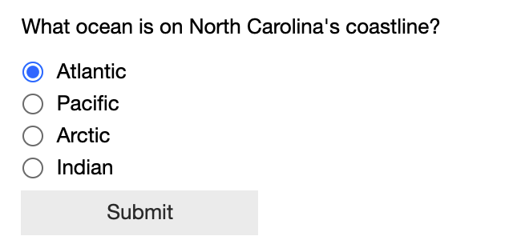
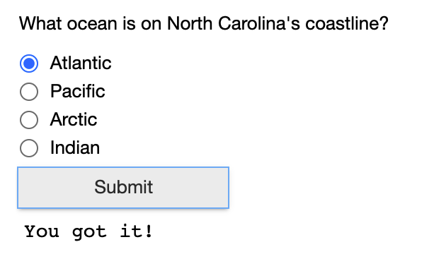
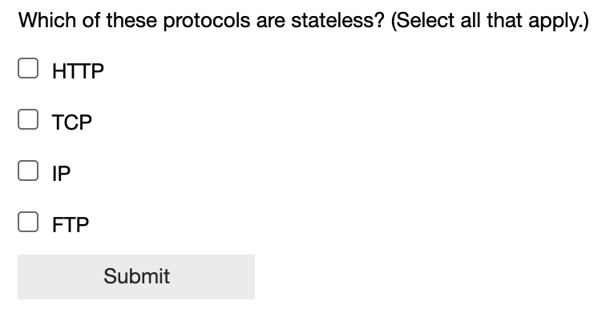
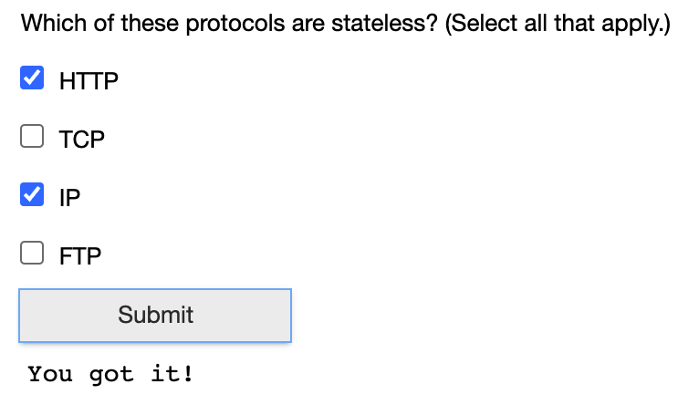

# jupyter4training

Jupyter Book and Jupyter Notebook have a lot of potential as a means of developing self-paced training content.

## How is training different from documentation?

Training is an interactive experience designed to enable a learner to perform a certain tasks. It's driven by [learning objectives](https://www.cmu.edu/teaching/designteach/design/learningobjectives.html) that define what a learner should be able to do after completing the training. Training should be engaging and interactive, and it should apply some instructional design best practices to optimize the learning experience. Most training is also designed to collect data from learners in order to provide them feedback on their progress and/or to monitor learner completions and success with the content.

This is fundamentally different from documentation. Documentation is a passive resource designed to convey information without targeting a specific objective for the reader. It's also designed to be a searchable reference where someone can find the exact piece of information they need on demand.

## The functionality we need for training

We already have the ability to embed media in a Jupyter notebook. What we need is the ability to assess the learner's progress and collect the data from those assessments.

That's the first thing we're focusing on in this project.

## Question type: multiple choice, single answer

One of the code cells in [quiz-testing.jpynb](https://github.com/stefwrite/jupyter4training/blob/main/quiz-testing.ipynb) uses the radio button widget to set up a multiple choice question with a single correct answer choice. When running the notebook with ipywidgets (e.g. installed locally or with CI), here's what that output should look like when you run the cell, both before and after responding to the question:

## Question type: multiple choice, one or more answers

One of the code cells in [quiz-testing.jpynb](https://github.com/stefwrite/jupyter4training/blob/main/quiz-testing.ipynb) uses the checkbox widget multiple times to set up a multiple choice question with one or more answer choices. When running the notebook with ipywidgets (e.g. installed locally or with CI), here's what that output should look like when you run the cell, both before and after responding to the question:

